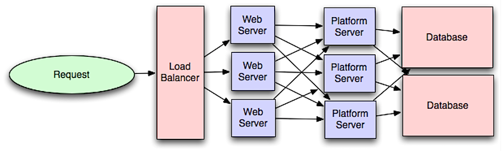

# Application Layer

Tách biệt lớp web và lớp ứng dụng (còn gọi là lớp nền tảng) cho phép bạn mở rộng và cấu hình cả hai lớp độc lập. Việc thêm một API vào hệ thống sẽ dẫn đến việc thêm các máy chủ ứng dụng mà không nhất thiết phải thêm máy chủ web. Nguyên lý trách nhiệm đơn lẻ (Single Responsibility Principle) khuyến khích việc xây dựng các dịch vụ nhỏ và tự trị hoạt động cùng nhau. Các nhóm nhỏ với các dịch vụ nhỏ có thể lên kế hoạch phát triển nhanh chóng hơn.

### Ưu điểm:
- **Mở rộng độc lập**: Tách lớp web và ứng dụng giúp bạn mở rộng từng lớp một cách độc lập, giúp cải thiện khả năng mở rộng và tính linh hoạt của hệ thống.
- **Quản lý dịch vụ nhỏ**: Các dịch vụ nhỏ, tự trị giúp dễ dàng phát triển, duy trì và triển khai nhanh chóng, đồng thời giúp các nhóm nhỏ dễ dàng phát triển hệ thống.
- **Tăng tính linh hoạt và khả năng phát triển**: Các API và máy chủ ứng dụng có thể được thêm mà không cần phải thay đổi cấu hình lớp web.

### Nhược điểm:
- **Đổi mới kiến trúc**: Thêm lớp ứng dụng với các dịch vụ lỏng lẻo đòi hỏi một cách tiếp cận khác biệt về mặt kiến trúc, vận hành và quy trình so với hệ thống đơn thể (monolithic system).
- **Tăng độ phức tạp**: Microservices có thể làm tăng độ phức tạp trong việc triển khai và vận hành hệ thống, đòi hỏi các công cụ và quy trình khác biệt.
