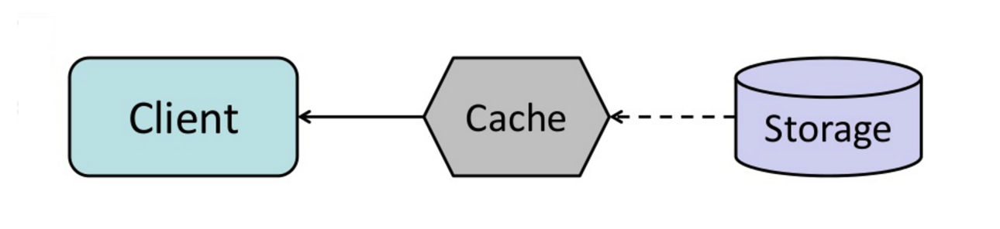

# Refresh-ahead (Làm mới trước)

**Refresh-ahead** là một chiến lược bộ nhớ đệm trong đó cache sẽ tự động làm mới các mục dữ liệu đã được truy cập gần đây trước khi hết hạn. Điều này giúp giảm độ trễ khi người dùng yêu cầu dữ liệu mà cache đã được làm mới sẵn sàng.

## Lợi ích của Refresh-ahead

- **Giảm độ trễ**: So với chiến lược **read-through**, **refresh-ahead** có thể giảm độ trễ nếu hệ thống có thể dự đoán chính xác các mục dữ liệu nào sẽ được cần trong tương lai.
- **Tăng hiệu suất**: Nếu cache có thể dự đoán chính xác các mục dữ liệu mà người dùng sẽ yêu cầu, việc làm mới trước giúp giảm thời gian phản hồi khi người dùng yêu cầu dữ liệu đó.

## Hạn chế của Refresh-ahead

- **Dự đoán không chính xác**: Nếu cache không thể dự đoán chính xác các mục dữ liệu nào sẽ được cần trong tương lai, việc làm mới trước có thể gây ra **giảm hiệu suất** so với việc không sử dụng **refresh-ahead**. Việc làm mới các mục không cần thiết sẽ tạo thêm tải cho hệ thống và giảm hiệu quả sử dụng tài nguyên.
- **Chi phí tính toán**: Quá trình làm mới trước có thể tiêu tốn tài nguyên tính toán và băng thông không cần thiết nếu dự đoán không chính xác.

## Ví dụ

Giả sử một ứng dụng bán lẻ có các sản phẩm được xem thường xuyên bởi người dùng. Hệ thống có thể sử dụng chiến lược **refresh-ahead** để làm mới các mục sản phẩm mà dự đoán sẽ được truy cập nhiều trong tương lai, ví dụ như các sản phẩm bán chạy nhất hoặc sản phẩm có chương trình khuyến mãi.

Tuy nhiên, nếu dự đoán sai, các sản phẩm ít được truy cập có thể sẽ được làm mới không cần thiết, gây lãng phí tài nguyên và giảm hiệu suất hệ thống.

## Kết luận

- **Refresh-ahead** có thể giúp cải thiện độ trễ và hiệu suất của hệ thống nếu hệ thống có thể dự đoán chính xác các mục dữ liệu cần làm mới.
- Tuy nhiên, nếu dự đoán không chính xác, chiến lược này có thể dẫn đến hiệu suất thấp hơn so với việc không sử dụng **refresh-ahead**.