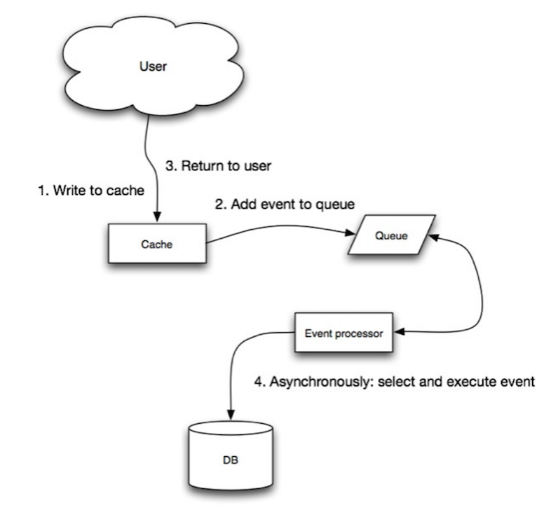

# Write-behind (Ghi sau vào cơ sở dữ liệu)

**Write-behind** là chiến lược bộ nhớ đệm trong đó ứng dụng thực hiện các bước sau:

1. **Thêm hoặc cập nhật mục trong cache**: Khi có yêu cầu ghi dữ liệu, hệ thống sẽ lưu dữ liệu vào cache trước.
2. **Ghi dữ liệu vào cơ sở dữ liệu một cách bất đồng bộ**: Sau khi dữ liệu được lưu vào cache, hệ thống sẽ ghi dữ liệu vào cơ sở dữ liệu trong nền, giúp cải thiện hiệu suất ghi.

## Lợi ích của Write-behind

- **Cải thiện hiệu suất ghi**: Việc ghi dữ liệu vào cache trước giúp giảm tải cho cơ sở dữ liệu và giảm độ trễ, đặc biệt trong các hệ thống có khối lượng ghi lớn.
- **Tăng khả năng chịu tải**: Vì dữ liệu được ghi vào cache trước, hệ thống có thể xử lý các yêu cầu ghi nhanh chóng mà không phải đợi quá trình ghi vào cơ sở dữ liệu.

## Hạn chế của Write-behind

- **Mất dữ liệu nếu cache gặp sự cố**: Nếu cache gặp sự cố (ví dụ như bị sập) trước khi dữ liệu được ghi vào cơ sở dữ liệu, có thể xảy ra **mất dữ liệu**.
- **Phức tạp khi triển khai**: Việc triển khai **write-behind** phức tạp hơn so với các chiến lược như **cache-aside** hoặc **write-through**, vì nó đụng đến việc quản lý quá trình ghi bất đồng bộ và đồng bộ hóa giữa cache và cơ sở dữ liệu.

## Ví dụ

Giả sử một ứng dụng e-commerce ghi lại các đơn đặt hàng của người dùng vào hệ thống. Khi người dùng tạo đơn hàng, dữ liệu được lưu vào cache ngay lập tức để phản hồi nhanh chóng. Sau đó, hệ thống sẽ ghi dữ liệu vào cơ sở dữ liệu trong nền, giúp giảm tải cho hệ thống và cải thiện hiệu suất.

Tuy nhiên, nếu trong quá trình ghi dữ liệu vào cơ sở dữ liệu mà cache gặp sự cố (ví dụ, cache bị mất kết nối hoặc bị xóa), dữ liệu có thể bị mất hoặc không được đồng bộ chính xác.

## Kết luận

- **Write-behind** giúp cải thiện hiệu suất ghi và giảm độ trễ bằng cách ghi dữ liệu vào cache trước và ghi vào cơ sở dữ liệu trong nền.
- Tuy nhiên, chiến lược này có thể dẫn đến **mất dữ liệu** nếu cache gặp sự cố và đòi hỏi sự phức tạp trong triển khai hơn so với các chiến lược khác như **cache-aside** hoặc **write-through**.
