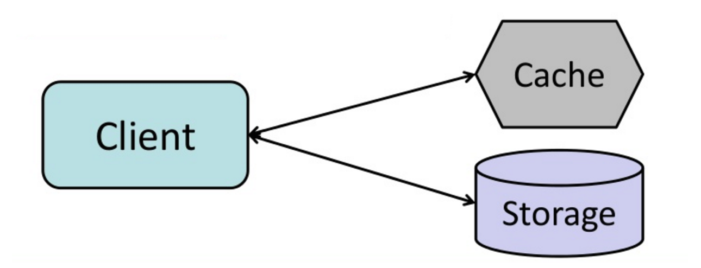

# Write-through (Ghi qua)

**Write-through** là chiến lược bộ nhớ đệm trong đó ứng dụng sử dụng cache như một kho dữ liệu chính để đọc và ghi dữ liệu. Cache sẽ đảm nhiệm việc đồng bộ ghi và đọc dữ liệu từ cơ sở dữ liệu.

## Quy trình hoạt động của Write-through

1. **Thêm hoặc cập nhật mục trong cache**: Ứng dụng sẽ ghi dữ liệu vào cache đầu tiên.
2. **Ghi dữ liệu đồng bộ vào cơ sở dữ liệu**: Sau khi dữ liệu được ghi vào cache, cache sẽ đồng bộ ghi dữ liệu vào cơ sở dữ liệu.
3. **Trả kết quả**: Sau khi dữ liệu đã được ghi cả vào cache và cơ sở dữ liệu, kết quả sẽ được trả lại ứng dụng.

### Mã nguồn minh họa:

Ứng dụng:

```python
set_user(12345, {"foo":"bar"})
```

Code của cache:

```python
def set_user(user_id, values):
  user = db.query("UPDATE Users WHERE id = {0}", user_id, values)
  cache.set(user_id, user)
```

## Lợi ích của Write-through

- **Dữ liệu luôn đồng bộ**: Dữ liệu trong cache không bị lỗi thời, vì mỗi lần ghi vào cache đều đồng bộ với cơ sở dữ liệu.
- **Tốc độ đọc nhanh sau khi ghi**: Sau khi dữ liệu được ghi vào cache, các lần đọc sau đó sẽ rất nhanh vì cache đã có sẵn dữ liệu.
- **Dễ dàng bảo trì**: Vì dữ liệu luôn được đồng bộ giữa cache và cơ sở dữ liệu, việc duy trì tính nhất quán giữa chúng là khá dễ dàng.

## Hạn chế của Write-through

- **Hiệu suất ghi chậm**: **Write-through** có thể là một thao tác chậm vì phải thực hiện ghi vào cache và cơ sở dữ liệu đồng thời, điều này làm tăng độ trễ trong quá trình ghi dữ liệu.
- **Node mới không có dữ liệu cache ngay lập tức**: Khi một node mới được tạo ra do lỗi hoặc mở rộng, nó sẽ không có dữ liệu cache cho đến khi mục đó được cập nhật lại trong cơ sở dữ liệu.
- **Dữ liệu ghi không được đọc**: Dữ liệu mới ghi vào cơ sở dữ liệu có thể không được đọc ngay lập tức, điều này có thể được giảm thiểu bằng cách sử dụng TTL (thời gian sống của cache).

## Ví dụ

Giả sử bạn có một hệ thống quản lý người dùng, khi có yêu cầu cập nhật thông tin người dùng, dữ liệu sẽ được ghi vào cache trước, sau đó được đồng bộ vào cơ sở dữ liệu. Điều này giúp các lần đọc tiếp theo sẽ nhanh chóng vì dữ liệu đã có sẵn trong cache.

Tuy nhiên, khi một node mới được triển khai (do mở rộng hoặc khôi phục từ sự cố), node này sẽ không có dữ liệu cache sẵn có cho đến khi có một thay đổi trong cơ sở dữ liệu và được ghi lại vào cache.



## Kết luận

- **Write-through** giúp đảm bảo tính đồng bộ giữa cache và cơ sở dữ liệu, giúp dữ liệu trong cache không bị lỗi thời.
- Tuy nhiên, chiến lược này có thể làm giảm hiệu suất ghi do phải ghi dữ liệu đồng thời vào cả cache và cơ sở dữ liệu.
- Để giải quyết một số vấn đề, như việc thiếu dữ liệu cache sau khi thêm node mới, có thể kết hợp **write-through** với **cache-aside** và sử dụng TTL để giảm thiểu tình trạng không sử dụng được dữ liệu ghi mới.