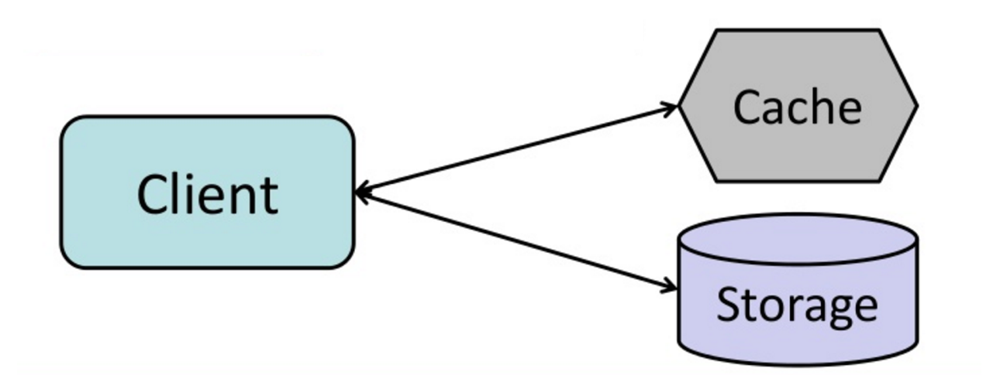

# Cache-aside (Bộ nhớ đệm theo yêu cầu)

**Cache-aside** (hay còn gọi là **Lazy Loading**) là chiến lược trong đó ứng dụng sẽ chịu trách nhiệm đọc và ghi dữ liệu từ kho lưu trữ. Cache không tương tác trực tiếp với kho lưu trữ, mà chỉ lưu trữ dữ liệu khi ứng dụng yêu cầu.

## Quy trình hoạt động của Cache-aside

1. **Tìm kiếm mục trong cache**: Ứng dụng sẽ tìm dữ liệu trong cache. Nếu không có dữ liệu (cache miss), ứng dụng sẽ tiếp tục bước tiếp theo.
2. **Tải dữ liệu từ cơ sở dữ liệu**: Khi không tìm thấy dữ liệu trong cache, ứng dụng sẽ truy vấn cơ sở dữ liệu để lấy dữ liệu cần thiết.
3. **Thêm dữ liệu vào cache**: Sau khi dữ liệu được tải từ cơ sở dữ liệu, ứng dụng sẽ lưu dữ liệu vào cache để các lần truy cập tiếp theo nhanh hơn.
4. **Trả kết quả**: Dữ liệu sau khi được lưu vào cache sẽ được trả về ứng dụng để sử dụng.

### Mã nguồn minh họa:

```python
def get_user(self, user_id):
  user = cache.get("user.{0}", user_id)  # Kiểm tra trong cache
  if user is None:  # Nếu không có dữ liệu trong cache (cache miss)
    user = db.query("SELECT * FROM users WHERE user_id = {0}", user_id)  # Tải từ cơ sở dữ liệu
    if user is not None:
      key = "user.{0}".format(user_id)  # Tạo khóa cho cache
      cache.set(key, json.dumps(user))  # Lưu vào cache
  return user
```

## Lợi ích của Cache-aside

- **Tiết kiệm bộ nhớ cache**: Dữ liệu chỉ được lưu vào cache khi có yêu cầu, giúp tránh việc lưu trữ những dữ liệu không cần thiết, giảm thiểu việc lãng phí bộ nhớ.
- **Tăng tốc độ truy xuất**: Các lần đọc tiếp theo sẽ rất nhanh chóng vì dữ liệu đã có sẵn trong cache.
- **Dễ triển khai**: Vì chỉ lưu trữ dữ liệu khi có yêu cầu, cache-aside rất đơn giản và dễ triển khai trong các hệ thống không cần lưu trữ tất cả dữ liệu vào cache.

## Hạn chế của Cache-aside

- **Cache miss ban đầu**: Khi lần đầu tiên dữ liệu được yêu cầu, ứng dụng sẽ phải truy vấn cơ sở dữ liệu và sau đó lưu vào cache. Điều này có thể làm tăng độ trễ trong lần truy cập đầu tiên.
- **Cập nhật dữ liệu trong cache**: Khi dữ liệu thay đổi trong cơ sở dữ liệu, cache cần phải được làm mới để tránh lưu trữ dữ liệu lỗi thời. Điều này có thể yêu cầu thêm cơ chế quản lý, như TTL (thời gian sống của cache) hoặc invalidate.

## Ví dụ

Giả sử bạn có một hệ thống e-commerce và cần tải thông tin người dùng từ cơ sở dữ liệu. Với **Cache-aside**, khi người dùng yêu cầu thông tin, ứng dụng sẽ kiểm tra trong cache trước. Nếu không có, dữ liệu sẽ được tải từ cơ sở dữ liệu và sau đó lưu vào cache để phục vụ các lần truy cập sau.



## Kết luận

- **Cache-aside** giúp giảm tải cho hệ thống bằng cách chỉ lưu trữ dữ liệu khi có yêu cầu, và các lần đọc sau đó sẽ nhanh hơn nhờ có dữ liệu trong cache.
- Tuy nhiên, có thể gặp phải độ trễ ban đầu (cache miss) và yêu cầu phải có cơ chế quản lý cache hợp lý để tránh lưu trữ dữ liệu lỗi thời.